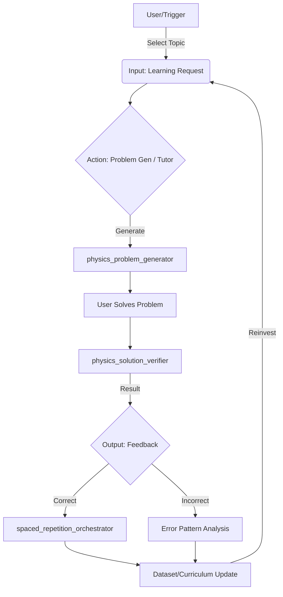

# IMPL-001: Astronomy & Physics Learning Automation with Open Responses

## 0. Prerequisite: Repository Stabilization (Immediate)
Before starting the new learning modules, we must resolve the failed **REFACTOR-005** task to ensure a clean git state and passing CI.
- **Problem**: PR #39 failed `require-linked-issue` because the issue creation failed (label `type:fix` missing), resulting in an empty Issue Number.
- **Fix**:
    1. Check for the orphan issue or create a new one properly.
    2. Update PR #39 title/body to link to the correct issue (e.g., `Closes #40`).
    3. Ensure CI passes and merge.

## 1. Learning Skills Module Design
We will implement 6 core skills modules under `skills/` for Astronomy/Physics learning, adhering to the standard structure (`skill.md` + `src/`).

### 1.1 `astro_data_fetch`
- **Purpose**: Retrieve, cache, and normalize astronomical data (Planetary info, Star catalogs, NASA APOD).
- **Inputs**: Data source ID (e.g., `nasa_jpl`, `simbad`), Query parameters (date range, object ID).
- **Outputs**: Normalized JSON data (saved to `data/cache`), Retrieval logs.
- **How to run**:
  - PS: `pwsh ./skills/astro_data_fetch/src/fetch.ps1 -Source "nasa_jpl" -Object "mars"`
  - Bash: `bash ./skills/astro_data_fetch/src/fetch.sh --source nasa_jpl --object mars`
- **Eval**: Cache hit rate > 80%, Schema validation pass.
- **Security**: API Keys (NASA_API_KEY) via env vars only.

### 1.2 `astro_ephemeris_solver`
- **Purpose**: Calculate celestial positions and mechanics (Physics engine).
- **Inputs**: Object ID, Observer Lat/Lon, Time query.
- **Outputs**: CSV/JSON with Azimuth, Altitude, RA, Dec, Distance.
- **How to run**:
  - PS: `python ./skills/astro_ephemeris_solver/src/calc.py --input inputs.json`
  - Bash: `python3 ./skills/astro_ephemeris_solver/src/calc.py --input inputs.json`
- **Eval**: Accuracy vs JPL Horizons (tolerance < 0.1 deg).
- **Security**: None (Deterministic calculation).

### 1.3 `physics_problem_generator` (Open Responses Enabled)
- **Purpose**: Generate Physics/Astronomy problems with varying difficulty.
- **Inputs**: Topic (e.g., "Orbital Mechanics", "Kepler's Laws"), Difficulty (1-5), Count.
- **Outputs**: `problems.json` (Question, Correct Answer, Explanation, Rubric).
- **How to run**:
  - PS: `pwsh ./skills/physics_problem_generator/src/gen.ps1 -Topic "Gravity"`
  - Bash: `bash ./skills/physics_problem_generator/src/gen.sh --topic Gravity`
- **Eval**: LLM-as-a-Judge relevance score > 4/5.
- **Security**: LLM API Keys (OPENAI_API_KEY, GEMINI_API_KEY).

### 1.4 `physics_solution_verifier` (Open Responses Enabled)
- **Purpose**: Verify user solutions against generated problems using chain-of-thought.
- **Inputs**: `problem_id`, `user_submission` (text/latex).
- **Outputs**: Verification Object (IsCorrect: bool, Feedback: text, ErrorType: enum).
- **How to run**:
  - PS: `python ./skills/physics_solution_verifier/src/verify.py`
  - Bash: `python3 ./skills/physics_solution_verifier/src/verify.py`
- **Eval**: Precision/Recall on Golden Set > 90%.
- **Security**: LLM API Keys.

### 1.5 `spaced_repetition_orchestrator`
- **Purpose**: Manage SRS (Anki-style) cards and scheduling.
- **Inputs**: Learning History Log, New Content batch.
- **Outputs**: `review_queue.json` (Items to review today).
- **How to run**:
  - PS: `pwsh ./skills/spaced_repetition_orchestrator/src/schedule.ps1`
  - Bash: `bash ./skills/spaced_repetition_orchestrator/src/schedule.sh`
- **Eval**: Review retention rate tracking (simulated).
- **Security**: None.

### 1.6 `evals_cccd_loop`
- **Purpose**: Continuous Content/Code Delivery Loop. Runs regression usage of other skills.
- **Inputs**: Golden Set (Questions + Ground Truth).
- **Outputs**: Evaluation Report (`eval_report.md`), Regressions Alert.
- **How to run**:
  - PS: `pwsh ./skills/evals_cccd_loop/src/run_evals.ps1`
  - Bash: `bash ./skills/evals_cccd_loop/src/run_evals.sh`
- **Eval**: Self-health check (must exit 0).
- **Security**: Read-only access to artifacts.

## 2. Architecture: AI-assisted Learning & Open Responses

### 2.1 Learning Control Loop (Flowchart)


### 2.2 Open Responses Integration (Component Diagram)
Using Open Responses to standardize "Requesting a Generation" and "Verifying a Response" across different LLM providers (OpenAI, Gemini, Local).

```text
[Learning Agent / Orchestrator]
       |
       v
[Open Responses Standard Interface] <--- (Schema: CompletionRequest, ToolCall)
       |
   +---+-------------------------+
   |                             |
   v                             v
[Provider A: OpenAI]      [Provider B: Gemini/Antigravity]
   |                             |
   v                             v
[physics_problem_generator] [physics_solution_verifier]
```
- **Role**: acts as the middleware to switch between standard LLM calls and specialised "skills" calls without changing the core loop code.

## 3. Implementation Plan (Execution)

### 3.1 LEARN-001: Scaffolding & Data Skills (PR 1)
- **Goal**: Create folder structure for all 6 skills and implement the deterministic ones (`astro_data_fetch`, `astro_ephemeris_solver`).
- **Issues**:
  - `LEARN-001`: Scaffold skills modules & Impl Data/Physics engine.
- **AC**: `astro_data_fetch` can grab dummy/real structure; `astro_ephemeris_solver` returns valid calc. CI Passes.

### 3.2 LEARN-002: GenAI Skills with Open Responses (PR 2)
- **Goal**: Implement `physics_problem_generator` and `physics_solution_verifier` using a minimal Open Responses compatible wrapper.
- **Issues**:
  - `LEARN-002`: Impl GenAI skills with Open Responses adapter.
- **AC**: Can generate a physics problem and verify a correct answer via script.

### 3.3 LEARN-003: Orchestrator & Evals (PR 3)
- **Goal**: Implement `spaced_repetition_orchestrator` and `evals_cccd_loop`. Connect the full loop.
- **Issues**:
  - `LEARN-003`: Impl SRS logic & CCCD Eval loop script.
- **AC**: Run a full simulation: Gen -> Solve -> Verify -> Schedule -> Eval Report.

## 4. Immediate Next Step
Execute **REFACTOR-005 Fix** to unblock CI, then proceed to **LEARN-001**.
